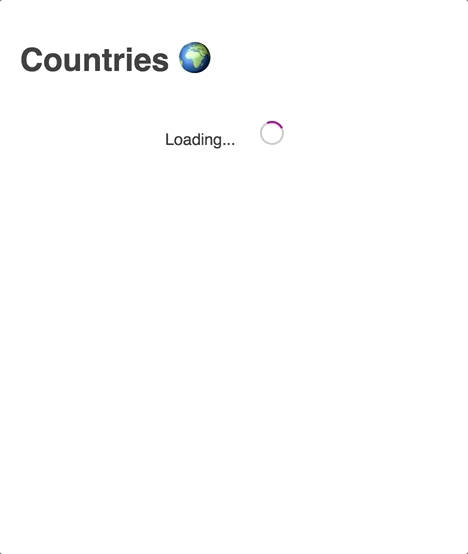

# How to fetch data from a GraphQL service

Using vanilla JavaScript to consume a GraphQL service: [http://countries-graphql-vanilla-js.surge.sh/](http://countries-graphql-vanilla-js.surge.sh/)



## Setup

```bash
npm install
```

## Local server

```bash
npm run serve
```

## Build

```bash
npm run build
```

## Resources

- [A collective list of public GraphQL APIs](https://github.com/APIs-guru/graphql-apis)
- [Public GraphQL API for information about countries](https://github.com/trevorblades/countries)
- [GraphQL - Current Working Draft](https://spec.graphql.org/draft/)
